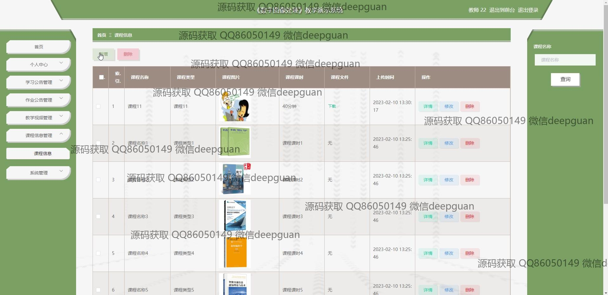
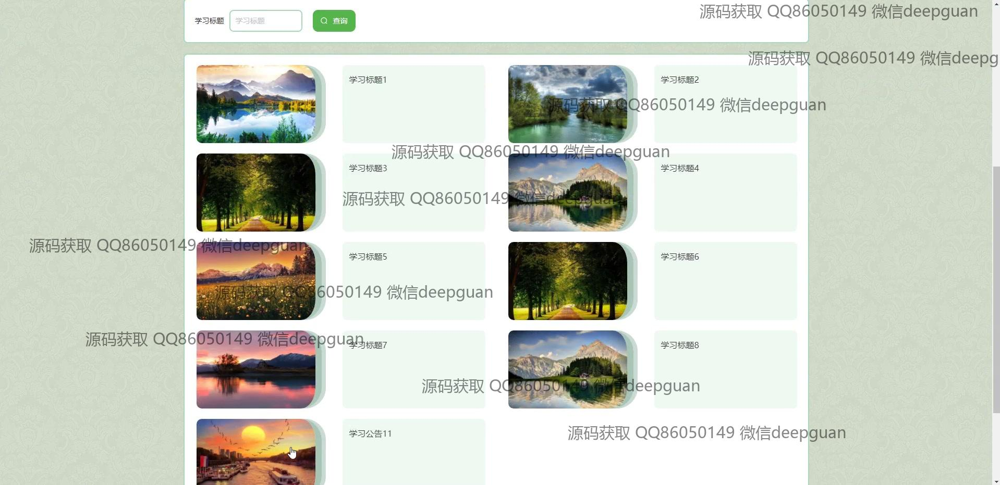
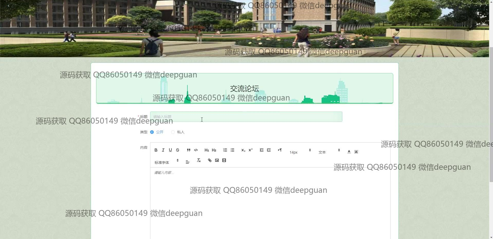
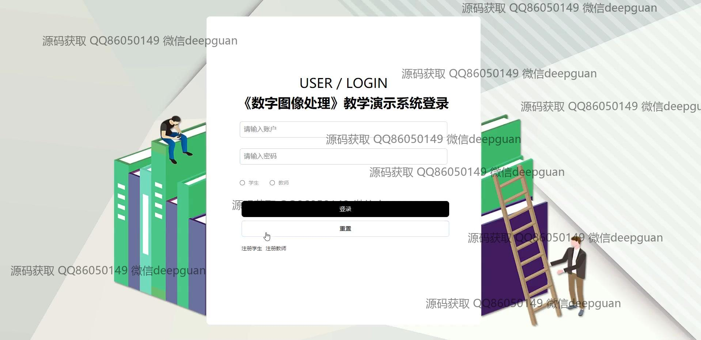

<h1 align="center">《数字图像处理》教学</h1>

## 简介
数字图像处理教学演示系统：角色分为管理员、用户；个人管理、学生管理、教师管理、课程信息管理、公告管理、视频管理、交流论坛、作业公告管理、注册登录管理。    --计算机毕业设计源码；毕设源码；java毕业设计源码

## 联系方式

<h3 align="center">获取完整代码与数据库文件 + 微信：deepguan QQ: 86050149 QQ群: 783742310</h3>

<h3 align="center">可帮忙远程部署 包运行成功！提供远程部署、修改代码、设计文档指导、代码讲解等服务！</h3>

## 功能介绍（完整见运行截图）
管理员： 提供用户登录、注销和注册功能，通过左侧导航栏进行学生管理、教师管理、课程管理以及系统设置等操作，支持公告管理和交流论坛管理，具备上传教学资源和编辑公告信息的权限，可以修改个人信息和查看系统统计。

教师： 主要负责上传和管理教学视频、课程信息和作业公告，通过左侧菜单进入个人中心，管理课程类型及教学内容，使用文本编辑器撰写和编辑课程简介，可以注册并维护个人账号信息，参与在线答疑和交流活动。

学生： 可以查看课程信息、学习公告和教学视频，通过登录界面访问个人中心，参与课程学习和讨论，提交作业和查看作业公告，利用系统提供的资源进行学习并获取课程资料，支持注册账号和修改个人信息。

访客： 用户在初次访问时能够注册系统以获取更多权限，进入系统后可以通过导航栏浏览课程信息、学习模块和公告，查看关于我们的信息和系统背景，访问交流论坛并进行评论和互动，浏览公共课程资源和系统介绍。

## 运行截图

本代码来源于网络,仅供学习参考使用!

